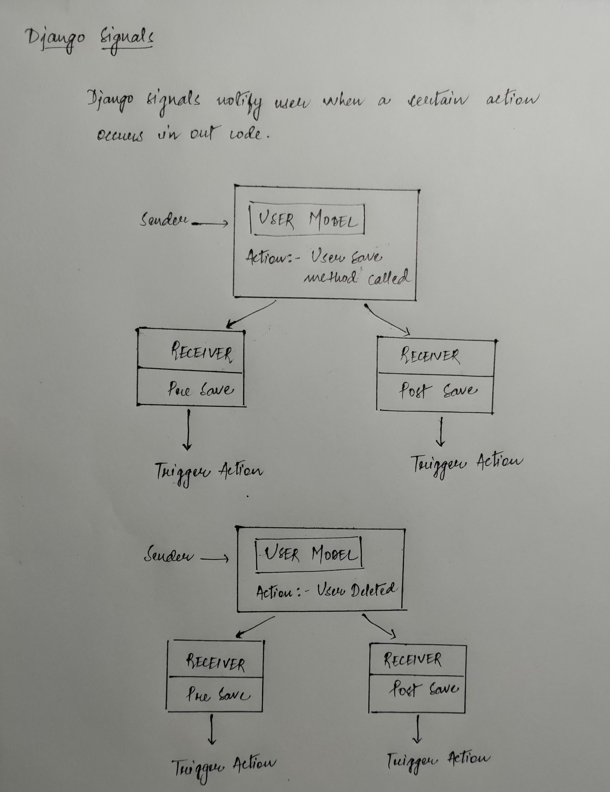

### Database Queries - QuerySet Lists

1. **all()** - Retrive all objects from the database.

    ```python
    queryset = ModelName.objects.all()
    ```

2. **get(attribute='value')** - Retrieve a single object based on matched attribute.

    ```python
    queryItem = ModelName.objects.get(attribute='value')
    ```

3. **filter(attribute='value')** - Returns all items from table that match a particular attribute value.

    ```python
    queryset = ModelName.objects.filter(attribute='value')
                                .filter(attribute__startswith='value')
                                .filter(attribute__contains='value')
                                .filter(attribute__icontains='value') # ignore case sensitivity
                                .filter(attribute__gt='value')
                                .filter(attribute__gte='value')
                                .filter(attribute__lt='value')
                                .filter(attribute__lte='value')
    ```

4. **exclude(attribute='value')** - Excludes any object matching a partiular filter.

    ```python
    queryset = ModelName.objects.exclude(attribute='value')
    ```

5. **order_by('value')** - Order a queryset by a particular column. Multiple parameters are allowed.

    ```python
    queryset = ModelName.objects.filter(attribute='value').order_by('value1', 'value2')

    # Order can be reversed by adding '-' before the column name
    queryset = ModelName.objects.filter(attribute='value').order_by('-value1', '-value2')
    ```

6. **create()** - Create an instance of a model.

    ```python
    item = ModelName.objects.create(attribute='value')
    ```

7. **save()** - Save changes made to a particular object

    ```python
    item = ModelName.objects.get(attribute='value')
    item.attribute = 'New value'
    item.save()
    ```

8. **delete** - Deletes a particular object.

    ```python
    item = ModelName.objects.last()
    item.delete
    ```

9. **Query Models Children**

    ```python
    item = ModelName.objects.first()
    item.childmodel_set.all()
    ```

10. **Query ManyToMany Fields**

    ```python
    item = ModelName.objects.first()
    item.relationshipname.all()
    ```

11. **Add ManyToMany Field**

    ```python
    item = ModelName.objects.first()
    otheritem = OtherModule.objects.create(attribute='value')
    item.relationshipname.add(otheritem)
    ```

## Django Signals



## Handling many to many relationships

[Link to Docs](https://docs.djangoproject.com/en/3.2/topics/db/examples/many_to_many/)
